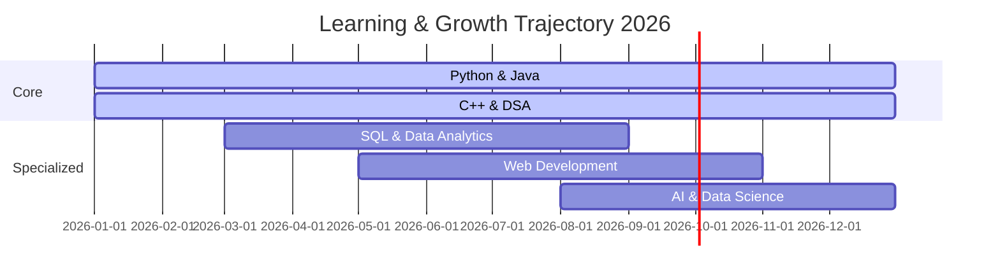

<!-- ╔══════════════════════════════════════════════════════════╗ -->
<!--                    PREMIUM HERO HEADER                     -->
<!-- ╚══════════════════════════════════════════════════════════╝ -->

 

 

  

<h3 align="center">
  <b>Computer Science Engineering Student</b>
</h3>

  <kbd>Software Development</kbd> • <kbd>Data Analytics</kbd> • <kbd>Problem Solving</kbd>

 

 

---

## 👨‍💻 ABOUT ME

I'm a **Computer Science Engineering student at Panimalar Engineering College**, passionate about software development, data analytics, and emerging technologies. My focus is simple: **learn continuously, build meaningful projects, and optimize every line of code.**

<table>
<tr>
<td width="50%" valign="top">

### 🎓 Education & Interests
- 🏫 **Degree:** Computer Science Engineering
- 📍 **Institution:** Panimalar Engineering College
- 💡 **Interests:** Backend Architecture, Analytics, Logic Building

</td>
<td width="50%" valign="top">

### 🎯 Current Focus
- 🧠 **Learning:** Python, Java, C++, SQL, DSA
- 🏗️ **Building:** High-impact utility projects
- 📈 **Goal:** Mastering Data Structures & Growing on GitHub

</td>
</tr>
</table>

---

## ⚡ TECH STACK

<b>Languages & Core Tech</b>

  

<b>Data, Analytics & Tools</b>

---

## 🚀 FEATURED WORK

<table>
  <tr>
    <td width="50%" valign="top">
      <h3>⚡ Piezoelectric Tile</h3>
      
A working model developed for a college ideathon demonstrating how <b>mechanical pressure can be converted into electrical energy</b>.

      
<code>Energy Harvesting</code> <code>Electronics</code>

    </td>
    <td width="50%" valign="top">
      <h3>🌳 Data Structures</h3>
      
Implementations and practice with fundamental data structures and algorithms for optimal problem solving.

      
<code>BST / AVL</code> <code>Stacks & Queues</code>

    </td>
  </tr>
  <tr>
    <td width="50%" valign="top">
      <h3>🐍 Python Projects</h3>
      
Programs developed while mastering Python fundamentals, data processing, visualization, and scripting.

      
<code>Automation</code> <code>Data Viz</code>

    </td>
    <td width="50%" valign="top">
      <h3>📊 Analytics</h3>
      
Exploring industry-standard tools and concepts for transforming raw data into meaningful, actionable insights.

      
<code>SQL</code> <code>Google Analytics</code>

    </td>
  </tr>
</table>

---

## 📊 GITHUB METRICS

  

---

## 🏆 ACHIEVEMENTS & CONTRIBUTIONS

  

<b>My Contribution Activity</b>

---

## 🗺️ 2026 ROADMAP

  

*(Rendered using native Mermaid.js support on GitHub)*

---

## 🔗 LET'S CONNECT

   

  

