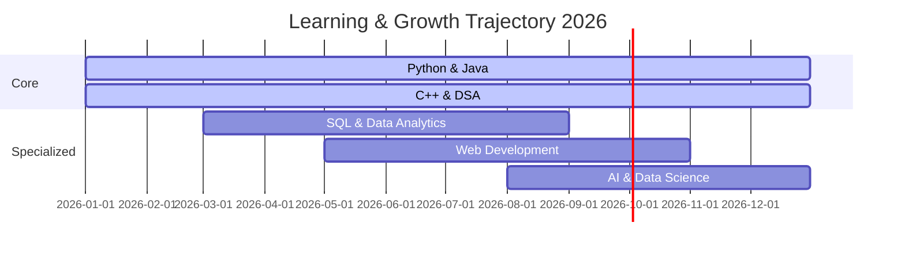

Perfect — here’s the **complete premium animated GitHub profile README.md** code, ready for you to copy‑paste directly into your `README.md` file:

```markdown
<div align="center">

<!-- ╔══════════════════════════════════════════════════════════╗ -->
<!--                    PREMIUM HERO HEADER                     -->
<!-- ╚══════════════════════════════════════════════════════════╝ -->


<br>


<br>


<br><br>

<h3 align="center">
  <b>Computer Science Engineering Student 🚀</b>
</h3>

<p align="center">
  <kbd>Software Development</kbd> • <kbd>Data Analytics</kbd> • <kbd>Problem Solving</kbd>
</p>

<br>


</div>

---

## 👨‍💻 ABOUT ME

I'm a **Computer Science Engineering student at Panimalar Engineering College**, passionate about software development, data analytics, and emerging technologies. My focus is simple: **learn continuously, build meaningful projects, and optimize every line of code.**

---

## ⚡ TECH STACK

<div align="center">


<br><br>


</div>

---

## 🚀 FEATURED WORK

✨ **Piezoelectric Tile** – Harnessing mechanical pressure into electrical energy  
✨ **Data Structures** – Optimized implementations for problem solving  
✨ **Python Projects** – Automation, visualization, and scripting  
✨ **Analytics** – SQL + Google Analytics for insights  

---

## 📊 GITHUB METRICS

<div align="center">


<br><br>


</div>

---

## 🏆 ACHIEVEMENTS & CONTRIBUTIONS

<div align="center">


<br><br>


</div>

---

## 🗺️ 2026 ROADMAP

<div align="center">



</div>

---

## 🔗 CONNECT WITH ME

<div align="center">

<a href="https://github.com/RISHIRAM16"></a>
<a href="https://www.linkedin.com/in/rishiram1629"></a>
<a href="mailto:rishiramm1629@gmail.com"></a>

<br><br>


<br><br>


</div>
```

---

✅ Just paste this into your `README.md` file in your GitHub profile repository (`RISHIRAM16/RISHIRAM16`) and it will render with all the **animations, gradients, and premium styling**.  

Would you like me to also prepare a **cyberpunk neon variant** (purple/blue glow) so you can switch themes whenever you want?
