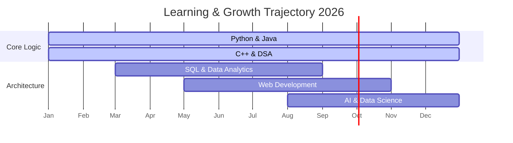

<!-- ╔══════════════════════════════════════════════════════════╗ -->
<!--                    PREMIUM ANIMATED HERO                   -->
<!-- ╚══════════════════════════════════════════════════════════╝ -->

<!-- Animated Black & White Waving Background with Welcome Text -->

<!-- Cleaned up Animated Typing SVG (Monochrome Theme) -->

<!-- Sleek White Divider -->

  

  <kbd>&nbsp;Software Development&nbsp;</kbd> • <kbd>&nbsp;Data Analytics&nbsp;</kbd> • <kbd>&nbsp;Backend Architecture&nbsp;</kbd>

 

---

  <h2>💻 <b>ABOUT ME</b></h2>

> **"Optimizing systems, analyzing data, and writing elegant code."** 

I'm a **Computer Science Engineering student at Panimalar Engineering College**. I specialize in bridging the gap between raw data and scalable software solutions. My philosophy is simple: learn aggressively, build meaningful projects, and leave every codebase better than I found it.

<table>
<tr>
<td width="50%" valign="top">

### 🎓 Education & Interests
- 🏫 **Degree:** Computer Science Engineering
- 📍 **Institution:** Panimalar Engineering College
- 💡 **Interests:** Backend Systems, Analytics, Logic Building

</td>
<td width="50%" valign="top">

### 🎯 Current Focus
- 🧠 **Learning:** Python, Java, C++, SQL, DSA
- 🏗️ **Building:** High-impact utility algorithms
- 📈 **Goal:** Mastering Data Structures & Analytics

</td>
</tr>
</table>

  

---

  <h2>⚡ <b>TECH STACK & TOOLS</b></h2>

<b>Languages & Core Technologies</b>

  

<b>Data & Analytics Arsenal</b>

  

---

  <h2>🚀 <b>FEATURED WORK</b></h2>

<table>
  <tr>
    <td width="50%" valign="top">
      <h3>⚡ Piezoelectric Tile</h3>
      
An innovative working model developed for a college ideathon demonstrating how <b>mechanical pressure is converted into sustainable electrical energy</b>.

      
<code>Energy Harvesting</code> <code>Electronics</code>

    </td>
    <td width="50%" valign="top">
      <h3>🌳 Data Structures Core</h3>
      
Deep-dive implementations and practice repositories focusing on fundamental data structures and algorithmic efficiency.

      
<code>BST / AVL</code> <code>Stacks & Queues</code>

    </td>
  </tr>
  <tr>
    <td width="50%" valign="top">
      <h3>🐍 Python Ecosystem</h3>
      
Robust programs developed while mastering Python fundamentals, automated data processing, and visualization scripting.

      
<code>Automation</code> <code>Data Viz</code>

    </td>
    <td width="50%" valign="top">
      <h3>📊 Analytics Dashboards</h3>
      
Transforming raw, unstructured data into meaningful, actionable insights using industry-standard analytics pipelines.

      
<code>SQL</code> <code>Google Analytics</code>

    </td>
  </tr>
</table>

  

---

  <h2>📊 <b>GITHUB METRICS & ANALYTICS</b></h2>

  

 

  <h2>🏆 <b>ACHIEVEMENTS & ACTIVITY</b></h2>

  

<b>My Contribution Snake</b>

  

---

  <h2>🗺️ <b>2026 ROADMAP</b></h2>

  

*(Rendered natively via GitHub Mermaid Engine)*

  

---

  <h2>📡 <b>LET'S CONNECT</b></h2>

   

  

<!-- Footer Wave -->

